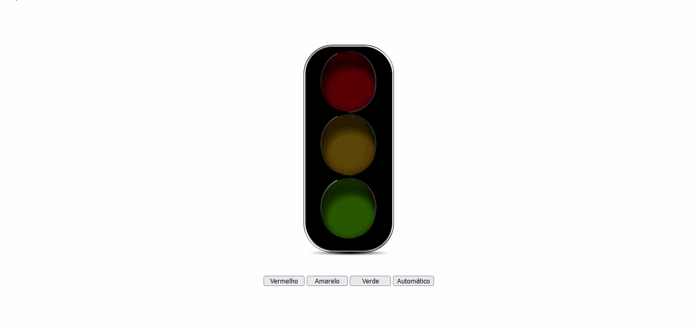

# Semáforo em Vanilla JS
 
 
 
 ## O que estou aprendendo neste projeto. 🚀
* **[JavaScript](https://developer.mozilla.org/pt-BR/docs/Web/JavaScript)**
* **[HTML](https://developer.mozilla.org/pt-BR/docs/Web/HTML)**
* **[CSS](https://developer.mozilla.org/pt-BR/docs/Web/CSS)**
* **[Objetos](https://developer.mozilla.org/pt-BR/docs/Web/JavaScript/Guide/Working_with_Objects)**
* **[setInterval](https://www.w3schools.com/jsref/met_win_setinterval.asp)**
